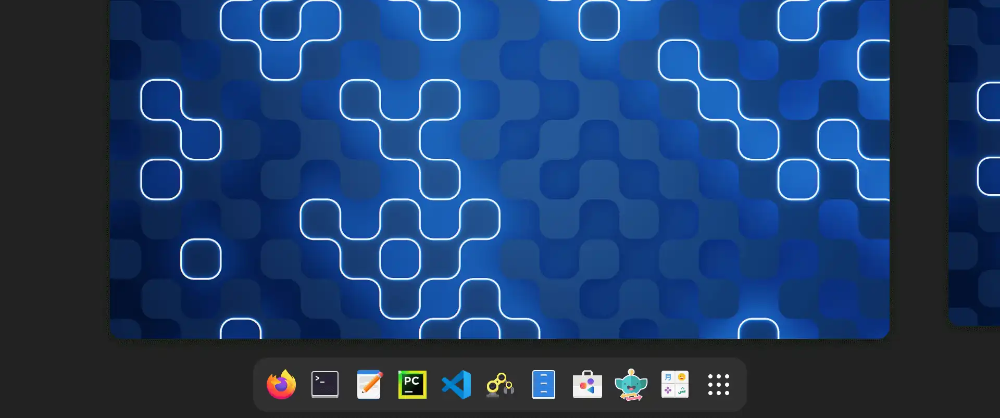

<h1 align="center">Hi 👋, I'm Renato Cruz (natorsc)</h1>
<h3 align="center">🚀 A passionate developer from Brazil, turning ideas into code and challenges into opportunities.</h3>

  

  

- 👨‍💻 All of my projects are available at [https://github.com/natorsc?tab=repositories](https://github.com/natorsc?tab=repositories)
- 💬 Ask me about **Python, Django, systems analysis and app development.**
- 📫 How to reach me **natorsc@gmail.com**
- ⚡ Fun fact **I love turning ideas into code and I’m always exploring new technologies to apply in real-world projects.**

<h3 align="left">Connect with me:</h3>

<h3 align="left">Languages and Tools:</h3>

                

&nbsp;

